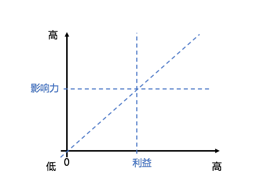

第五模块|借势  23 结盟：利益相关人地图

你好，我是梁宁，欢迎来到我的课程《增长思维30讲》。

这是我们借势这个模块的第三讲。上一讲我们谈了自我探索与长期关系，这是相对比较内圈、比较紧密的共生环境建设。

这一讲我们谈相对外圈一点的共生关系，利益结盟。

内圈的共生关系，更多是基于共同价值观的互利与陪伴，能进入你内圈的人也没那么多。

而外圈，我们可以说就是你能接触到的整个世界了，你应该如何主动付出，去培养自己的生态环境呢？

利益相关人地图

我们需要画一张利益相关人地图。

利益相关人地图不是什么厚黑学，这是服务设计的一个常用工具。

我们做事情要和很多人协作，内部的人、外部的人、不同的客户、直接的伙伴、间接的伙伴、对手等等。每一件事都有很多角色参与其中，并且交互影响，交互作用。

如果我们把所有的角色，只用两个维度来衡量，就是这个角色在你这件事上的影响力和利益，就可以得到一张利益相关人地图。这是非常简洁的一个象限图。

横轴是利益，从左到右是利益小到利益大。纵轴是影响力，从低到高是影响力小还是影响力大。

下一个动作，就是把每一个角色在你这件事里获利的大小，和影响力的大小，一个一个放在象限的不同位置。

然后，你一边画图一边问自己，对你这件事影响力最大的人，在你这件事里有利益吗？如果影响力最大的人，与你利益不一致，这就是风险。

比如，我一个朋友要推进一个公司内部的项目，找我咨询产品。我先请他画内部协同的利益相关人地图。画完以后，我指着地图上方一个叫“风控”的部门，我说：你看这个部门，你画出它有极大的影响力，但是它在你这件事的利益为0。

换句话说，一个人对你这件事的影响力达到了捅一指头你就会死，并且他还和你利益不一致。那当前最大的问题就不是产品设计问题。我说，你还是先去搞定内部协同，再找我吧。

那应该怎么做呢?

请客送礼吗？给钱吗？你这个项目是长期的，你请人家吃一次饭，让人家长期给你承担风险，这怎么可能呢？

一个人，一个企业，如何安排利益相关人地图，这个是实力，也是智慧。

武当老爹

我给你讲一个早年淘宝的案例，你可以先看看马云是怎么做的。

这个是淘宝2013年写的案例，我是在2016年看到的，当时读完之后很受触动，而且对淘宝心生敬仰。

这是一个什么故事呢？它讲了一个“武当老爹”的故事。

在湖北武当山脚下，有一个很穷的村庄，距离最近的镇子都有50公里的山路。这个村太穷了，年轻人都离开了，村里只剩下20几户人家。

我们的主人公“武当老爹”，就是这个村的村委书记。老爹的梦想就是带着全村的人一起致富，并且把已经离开的青壮年劳动力吸引回村里来。

这位老爹，2011年在县城租房做山货生意时，接触了淘宝。50多岁，只有小学4年级学历的老爹，毅然开始学习打字、学开淘宝店。

2012年3月，他开始启动了他的电子商务。

一个山村在2012年的时候能开淘宝店，依赖了两个客观条件。一个是中国电信的村村通工程，每个村都通了宽带，可以接入互联网；另外一个，是中国快递发展到了以镇为节点，这个村的物产只要送到镇上，就能发往全国各地。

所以，我们的物流条件，是中国电商爆发的基石。我们一单快递的价格，换算成美金就是1美金。1美金快递发全国，这在美国是不可能的。中国电商的爆发增长，我们国家的基础设施功不可没。

但是不是他有货，有网店，有物流设施，就能卖掉货呢？你也想得到，这肯定是不行的。

武当老爹是整个淘宝体系里能力最弱的一个人。为什么这么说呢？

第一，他电脑操作非常不熟，打字只会用一个指头，照片也不会拍，修图更是不会。

第二，他商务能力很差，产品说明都写不好，更别说营销文案、运营活动、搜索优化、网络推广这些高端选项了。这些都是不可能的。

武当老爹和他的村民，因为一根网线，而被突然间纳入现代商业。他们的商业认知和操作能力，依然还是自己熟悉的套路。

比如2013年，他们一斤香菇定价50元。因为这个价格是按照一位村民一天劳动的工价来定的。而其他所有的东西无论灵芝还是木耳，只要需要投入劳动力采摘，都按照每人每天50元工价为基准去进行计价。他们完全不懂得随行就市，促销这种高端操作那更不懂了。

第三点，他的交流能力不行。他连普通话都说不好，打字也非常慢，淘宝客服也是做不好的。

电脑能力不行，商务能力不行，交流能力不行，所以他在淘宝的体系里是最弱势的那一个。

而我们知道2012年，是淘宝流量第一次见顶。当时一批淘商家已经有了小成，大家开始注重专业化运作，更专业地购买流量和优化运营。所以像武当老爹这样的菜鸟，夹在一批已经专业化操作的卖家的缝隙里，几乎是没有露出机会的。

转机是这位武当老爹在淘宝的一个论坛里吐槽，说自己努力了好几个月都没有卖出东西。并且为了表示自己发言真实，他就把自己的身份证拍照发了上来。

这位晒身份证的老支书，让值班小二有点好奇，就真的还去核实了一下。结果发现这位老爹确实是一个村委书记，而且真的希望依靠这个淘宝店，带动他们村村民的生活。小二就被老支书的种种努力感动了。

后来，这个案例就被层层上报。上报的理由是：“这样的人，离现代商业远，自己能力差，也没有规模化的可能性，淘宝要不要支持？”

这件事就被一直提到了最高层。

当时我读这个案例非常震撼的是，淘宝决定支持这位武当老爹，他们的理由是：

“为了系统的正义。”

那份文档里，他们阐述了淘宝制度设计要遵循的“正义”：

淘宝制度设计的第一原理：体系的自由与开放。

这份文档内部评价，2012年的淘宝已经基本做到了体系的自由与开放，否则像武当老爹这样的店就不会出现。

他们进一步需要建设的系统正义是：不是让最强的人在淘宝赚到最多的利润，而是让弱的人也能在这个场域里活下来。

我当时读到这一段真的很震撼。一家商业公司，会讨论体系的制度设计与系统正义，这一点让我肃然起敬。

淘宝的选择

后来的故事就是，淘宝开始扶植武当老爹。

如果这种扶植只是做秀，其实有非常容易的方法，比如给钱，或者导点流量。

但淘宝的选择是大动筋骨，比如他们做了两件事：

第一是调整淘宝的搜索引擎机制，避免强者恒强，让弱者有露出的机会。

第二是建设人对人的帮助体系，以武当老爹的能力为范本，就是这种电脑不行、商务不行、沟通不行的人，每一处短板，都需要设置组织来提供系统帮助。

这一系列事情做完，淘宝的能力也发生了变化。淘宝就不只能帮助一个武当老爹，而是能帮助成千上万、上百万个，被城市化抛弃，指望通过互联网改变命运的人。

而武当老爹是一个真实的人，他同时代表了一个结构洞，就是后来的淘宝村，依托在淘宝体系上的村镇经济。

你说淘宝的系统正义，纯粹是出于对弱者的同情吗？

淘宝通过建设自己的能力，帮助了一批只能依靠它的弱者，这其中有慈悲，也有商业智慧。

对于淘宝这个平台而言，它需要考虑的两点：

第一是与强者的关系，如果淘宝不打压强者恒强的模式，就会放任流量被强者吸走。这些少数的强者一定会变成淘宝的癌细胞，快速生长，吞噬所有的资源。

可能淘宝上就会长出几个京东，接着几家一分裂，淘宝就死了。

扶植弱者，制衡强者，保证自己对资源的绝对控制权，淘宝才是安全的。

第二是弱者的杠杆意义。

一个武当老爹，卖山货无法形成规模。如果仅看直接的商业价值，武当老爹对淘宝价值不大。但我们说了，他代表的是一个结构洞。中国是一个农业国，中国有大量村庄只有自然资源和几个劳动力，没有更多可以改善生活的现代工具。

淘宝扶植这些淘宝村，使这家悬在天上的电商公司，与中国深厚的大地真正建立了连接。也就是因为这个点的勾连，淘宝与无数的村、镇、县，与中国广袤的社会，息息相关，血脉相连。

市场的背后是社会。商人看商业价值，政府看社会价值。因为这一系列的事情，淘宝有了社会价值。在阿里的利益相关人地图上，一些有影响力的单位，因此与淘宝有了利益相关。

所以，与其说马云是商业专家，毋宁说他是人性专家，杠杆专家。他非常善于使用杠杆，几乎所有的杠杆品类，他都是信手拈来。所以说，如果没有马云的这种设计，阿里也不会有今天的规模。

本讲小结

我们学利益相关人地图，是为了厘清和你这件事，有利益相关的所有角色，他们的位置，看到风险，看到抓手。

因为在一件长期的事情面前，你得让对你影响力大的人，在其中有利益，而且是长期的利益。

思考题

画一下你的一个项目的利益相关人地图。想想，对你影响力最大的那个人，他在你的项目里，有什么利益。

你也可以把这一讲，分享给你觉得需要厘清利益关系的朋友。

下一讲，我们聊借势的另一种状态：在风口，闪电式扩张。

我是梁宁，我们下一讲见。
